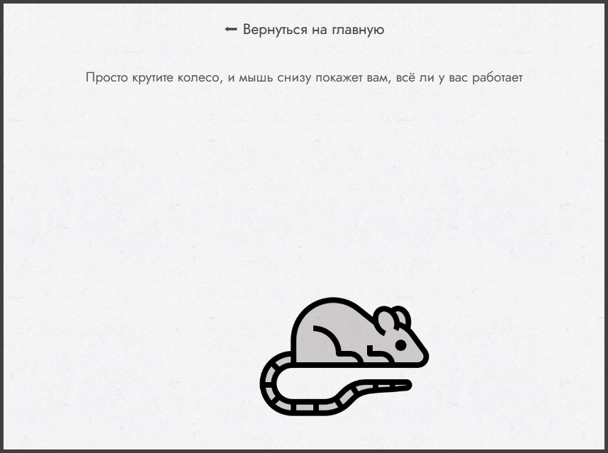

# mousewheel-checker
Demo: https://cat-in-a-box.github.io/mousewheelchecker

A react application with a purpose to check wheel rotation on my broken mouse. 
Just to understand if its working properly or not
 

